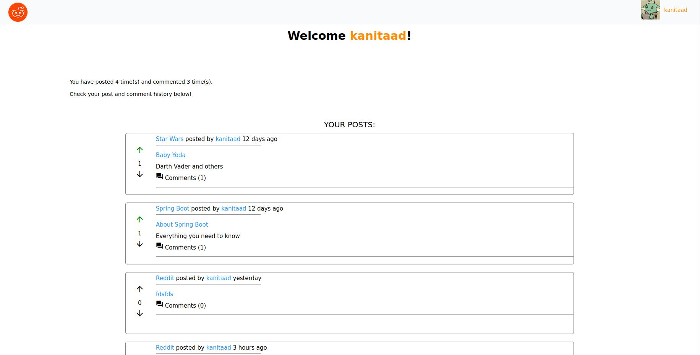

# reddit-clone

Reddit Clone is a REST-based web application made with Spring Boot and Angular.

## Build
List of languages and frameworks the project uses:

- Java
- Spring Boot
  - Spring Boot Web
  - Spring Boot Mail (mailtrap.io)
  - Lombok 
  - JPA
  - Spring Boot Security
  - JWT Auth
  - MapStruct
- Angular
  - Angular Material
- MySQL

## About The Project
The project was implemented as a simple version of Reddit. Main focus of the project was to learn and improve both backend and frontend technologies.

Verified users can create new reddits and posts, as well as upvote and comment existing posts.

Profile page lists posts and comments the user has made.

